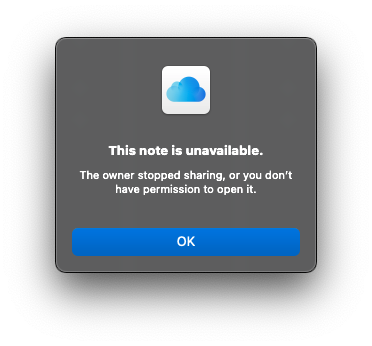
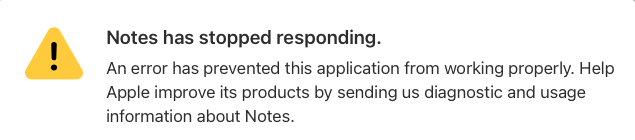

It’s my fucking note Apple. I just want to link to it. On my computer. With a real link that opens a real program. Not one that punts to a browser tab that soft-locks the entire browser because an unnecessary request for TouchID took precedent over: the system, the running application and user input.

Apple Notes is not a trustworthy place to organize things. It doesn't matter how convenient it is. It might still have value as an inbox, but I'm putting this here to remind myself **never leave anything valuable here again**.

